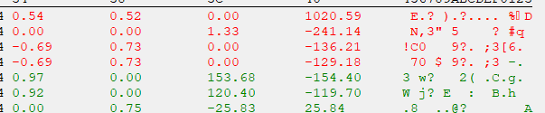

**参考文章**
https://github.com/frk1/hazedumper

## 环境

Steam里的CS:GO 和 Cheat Engine7.4


## 寻找偏移前的准备

进入游戏，选择人机练习赛，进入游戏，在游戏内使用`键打开控制台，在游戏控制台内输入如下指令

```C++
sv_cheats 1
mp_roundtime_defuse 60
bot_stop 1
mp_restartgame 1
```
指令完成后休闲模式变成60分钟一局，机器人暂停，以方便基址的查找，不然找一会儿游戏重新开始了，又要重找

使用CheatEngine附加到CS:GO进程

## 1. 找自己的角度

**角度**：是人物面朝的方向，有上下角度和左右角度(摇头，点头)，在游戏开始时，上下角度和左右角度都为0，角度是单浮点类型，头抬到最上方时，上下角度=-89，低到最低的时候上下角度=89，左右角度和上下角度的数值是连在一起的

### 实操

最大仰角状态：锁定视角到最高点 → CE执行精确数值扫描【-89.0】

最大俯角状态：压低视角到最低点 → CE执行精确数值扫描【89.0】

轻微上抬视角 →  数值减少 ， 轻微下压视角 →  数值增加

通过3-5次视角微调配合CE的数值变化扫描，最终将目标锁定在一组数据中
  

筛选数据(二分筛选法)

1. 用Ctrl+A全选地址 → 按Shift+左键选中前50%
2. 批量修改选中地址为测试值
3. 立即观察视角是否发生异常偏移
4. 若视角变化→保留选中地址/无变化→保留未选地址
5. 几次后能找到一个正确的数值(或者几个)，修改数值，视角变化，则确定是上下角度
  

选择浏览相关内存区域，寻找左右角度，一般上下角度和左右角度是连在一起的，将数据显示模式改为浮点型


  

可以在上下坐标(29.40)右侧，发现数据(-130.82)，修改右侧数据，人物画面左右移动，则确认是左右角度

  

由此得到：上下角度的偏移值=FBF64DA0 、 左右角度偏移值= 上下角度偏移值+4

### 找到基址

寻找基址一般有两种方法，一种是通过CE扫地址，来追基址，一种是读汇编，不断找上层call，这边就采用第一种来举例

下一个访问断点

  


可以看到视角来源于ESI+4D90

上下角度 = [ESI+4D90]   ESI=FC690010

  

CE中搜索 FC690010(ESI) ，看哪块内存保存了ESI的值，直接搜出来一个基址，直接拿来用就行了


  

得到 ESI=[engine.dll+58CFDC],结合上下角度 = [ESI+4D90]，得到：

上下角度 = [[engine.dll+58CFDC]+00004D90]

左右角度 = [[engine.dll+58CFDC]+00004D90]+4

得到人物角度的基址


## 2. 找自己的坐标

坐标：游戏中人物的坐标是三维的，其数据类型为浮点型，其中Z轴的值是最好确认增加和减少的，所以采取的方法是先寻找Z轴的值，在Z轴旁边的就是X,Y轴的值

找坐标的方法：几次搜索后可以得到Z轴的值，得到Z轴的地址后，X,Y轴的地址就在Z轴地址旁边

在游戏中找一个箱子，CE先搜索未知的初始值(单浮点)

  


跳到箱子上后CE再次搜索增加的数值

  

从箱子上跳下来后CE搜索减少的数值

  

不移动人物，进行开枪，开镜，换弹，丢枪操作后CE搜索未变动的数值，在平地上左右移动后搜索未变动的数值

  

来回反复几次，最后过滤到四百多条，基本过滤不动了，将所有的结果添加到下面，再次筛选

### 筛选方法

对半修改，选择一半，改为一个随便的值，看人物的是否上下移动

如果上下移动，则说明其中有正确的值，将另外一半的地址删除

重复，直到出现一个或多个值

注：游戏改崩了很正常，不要在意，重新来过

  

选择浏览相关内存区域，可以看到Z轴的数据前有两个数据，通过修改，人物前后左右移动，确定是X轴的值和Y轴的值

  

得到：

z坐标 = 7808B764

x坐标 = z坐标的地址 - 8

y坐标 = z坐标的地址 - 4

进入下一步，通过偏移值寻找基址(至于为什么没有图，原因是忘记截了，又懒得再搞一遍了)

先下访问断点，得到 Z轴的坐标 = [EDI + 000001E4] 　　EDI = 7808B580

在ce里四字节，十六进制 搜索7808B580(EDI)，得到两个基址，里面储存了7808B580，随便拿一个用，可以得到 EDI=[server.dll+AC6258]

综上所述：

Z轴 = [[server.dll+AC6258]+1E4]

x轴 = [[server.dll+AC6258]+1E4-8]

y轴 = [[server.dll+AC6258]+1E4-4]

得到人物坐标的基址

## 3. 找敌人的的坐标

坐标：敌人的坐标也是三维的，前文已经找到自己的坐标，可以通过自己与敌人的相对位置来找，即，自己站的比敌人低则搜索值大于***(自己的坐标)

找坐标的方法：

先在游戏控制台输入

```
mp_limitteams 0
bot_kick
bot_add_ct
```

把其他机器人都踢掉，只留一个ct，方便查找

先搜索单浮点，未知的初始值

自己站的比敌人高则搜索值小于***(自己坐标)，此时站得比CT高，自己的z轴是56，搜索值小于56

  

自己站的比敌人高则搜索值小于***(自己坐标)，此时站得比CT低，自己的z轴是-102，搜索值大于-102
  

此时和CT同一高度，则搜索值等于0.27

  


期间可以通过bot_stop 1 指令使机器人停止活动，以方便查找

经过几次重复可以找到几百个值，选取修改，如果修改后人物浮空，则说明正确的值在其中，则删除另外一半的值，反复几次，得到一个正确的偏移值

  

选择浏览相关内存区域，显示类型改成单浮点，可以看到敌人的X轴和Y轴

  

### 通过偏移值寻找基址

选择敌人x，y，z轴中的一个，使用上面使用的方法(下访问断点，搜上一层偏移)可以得到

人物的坐标 = [[client.dll+0x4DDD91C]+138]

此时需要补充一个知识点，在游戏开发的过程中，同样类型的事物会被写成类，而在游戏中实例化对象，像CS:GO此类fps游戏中，人物对象一般都包括人物的血量，人物的护甲，人物开镜状态，人物蹲起状态，人物的位置，人物的骨骼矩阵，人物视角矩阵，而此偏移138，则有可能是人物的位置，通过CE,可以分析这个结构，判断其他偏移

选择查看内存，分析数据结构

  


在框中输入client.dll+0x4DDD91C，选择 结构->定义新结构，得到如下视图,可以发现，每个指向C_CSPlayer对象的指针之间都差0x10

  

点开一个结构，可以在A8处看见人物的Z轴坐标

  

在100处看见人物的血量

  

则可以得到

人物的血量 = [[client.dll+0x4DDD91C]+100

人物的Z轴坐标 = [[client.dll+0x4DDD91C]+A8

其他的数据也都可以通过这个指针来分析，故总结一些就是通过人物的坐标( [[client.dll+0x4DDD91C]+0x138]) 找到 人物对象([client.dll+0x4DDD91C]) ,通过人物对象找到血量([client.dll+0x4DDD91C]+0x100)

## 4.找自己的视角矩阵


注：只写方法，没有截图

视角矩阵：这是个3D游戏，但屏幕是二维的，所以需要一种方法把3D的坐标转换为屏幕上的2D坐标，这个是通过视角矩阵和人物坐标实现的

矩阵的特征：

4x4

array[0][0]不开镜的时候小于1

自己的矩阵下面一行会跟着一行几乎一样的数据

视角转变会变化，开镜会变化

抬头(最上面)看的时候，array[3][3]和array[3][4]都是1.00

低头(最下面)看的时候，array[3][3]和array[3][4]都是-1.00

方法：

先搜未知的初始值，转个头、开个镜、转个身 都搜变动的数值，不动视角切枪，换弹，搜未变动的数值，几次下来就剩下几个数值了

挨个点击浏览相关内存，动视角，看哪一块内存是4*4的动，再不动，单独看开镜，是否变动，结合上面的1.00和-1.00直到找到觉得正确的值

可以在内存里看到矩阵

  


## 至此，找偏移的部分就结束了