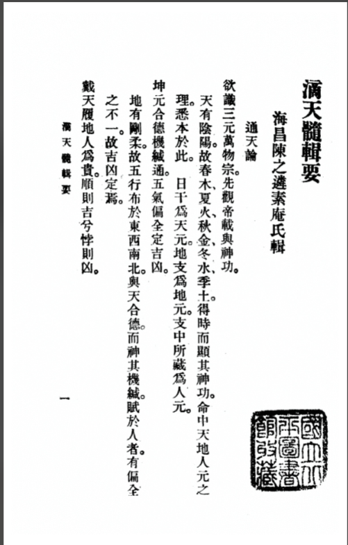

版本：中华民国二十五年七月一日初版

 

## 序

滴天髓之书，乃一知名者所作，托于诚意伯刘基。其书穷干支之情，通阴阳之变，不拘格局，不用神煞，但从命理推求，愈入愈微，愈微愈显，诚此道之专精，术家之拔萃也。世俗狃于子平诸旧书，或谓其高远无当，不知干支八字，数也，有理焉，言数则必有难通，言理则无所不贯。学者得是书而详味熟玩之命之理，晓然于心，用以推数，安有执一而不全，臆断而罔验者乎？但命名未雅，其论次亦颇参错，且间有不达意者。余故厘正其篇目，而辞句则少点定之。然非有改于旧观，故仍其名。嗟夫！高识渺论如此，何减于诚意杂撰，而顾附托名以求传后世，世之怀才而不得自见，若是君者，可胜道哉！

顺治戊戌春二月望日。素庵老人书

## 滴天髓辑要目录

通天论，干支论，天干论，形象论，地支论，方局论，格局论，体用论，从化论，精神论，岁运论，衰旺论，中和论，寒暖论，刚柔论，月令论，顺逆论，生时论，源流论，真假论，通隔论，隐显论，清浊论，众寡论，奋郁论，恩怨论，顺反论，战合论，震兑论，坎离论，君臣论，母子论，才德论，性情论，疾病论，閒神论，绊神论，六亲论，出身论，地位论，贵贱贫富吉凶寿夭论，贞元论

## 通天论

欲识三元万物宗，先观帝载与神功。天有阴阳，故春木、夏火、秋金、冬水、季土，得时而显其神功。命中天地人元之理，悉本于此。日干为天元，地支为地元，支中所藏为人元。坤元合德机缄通，五气偏全定吉凶。地有刚柔，故五行布于东南西北，与天合德，而神其机缄，赋于人者，有偏全之不一，故吉凶定焉。

戴天履地人为贵，顺则吉兮悖则凶。

凡物莫不得五行，而戴天履地惟人得五行之全，故为贵，其有吉凶不一者，以其得于五行之顺与逆也。欲与人间开聋瞆，顺悖之机需理会

不知命者如聋瞶，知命者于顺悖之机，能理会之，庶可以开之耳，理行承气岂有常，进兮退兮宜抑扬。翕辟往来皆是气，而理行乎其间。行之始而进，进之极则为退之机，如三月甲木是也，行之盛而退，退之极则为进之机，如九月甲木是也，学着能抑扬其浅深，斯可以言命

配合干支仔细详，断人祸福于灾祥，干支配合，细详其进退之机。

五阳皆阳丙为最，五阴皆阴癸为至（其实这里就有思考，丙为阳气之极，阳极阴生，所以丁不能是阳极，但壬为极阴，为什么癸阴极阳生，却是最阴）

甲丙戊庚壬为阳，独丙火禀阳之精，而为阳中之阳，乙丁己辛癸为阴，独癸水禀阴之精，而为阴中之阴。

五阳从气不从势，五阴从势无情义。

五阳得阳之气，即能成其阳刚，不畏财杀之势，五阴得阴之气，即能成其阴顺，故木盛则从木，火盛则从火，金盛则从金，水盛则从水，土盛则从土，于情义之所在，见其势衰则忘之，若从得其正，亦未必至于无情义也。

## 干支论

阳顺阴逆，其理固殊，阳生阴死，其论勿执。

以天干布地支，而生死之道出焉，阳顺阴逆，其理非无出也。然甲木死于午，午为泄气之地，理固然矣，乙木见亥，亥中有壬水，乃其嫡母，何为死哉？凡此皆详其干支轻重之机，母子相依之势，阴阳消息之理，而论吉凶可也。若专执死生推断，则误矣。

天全一气，不可使地道莫之载。四甲四乙，而遇寅申卯酉相冲，为地莫载。

地全三物，不可使天道莫之覆，寅卯辰，而遇甲乙庚辛相冲，为天莫覆。

阳乘阳位阳气昌，最要行程安顿。

六阳之位，独子寅辰为阳方，乃阳位之纯，五阳居之，其旺无比，其行运最宜阴顺安顿之地。

阴乘阴位阴气盛，还须道路光亨。六阴之位，独未酉亥为阴方，乃阴位之纯，五阴居之，其盛无比。其行运宜阳明光亨之地。

地生天者，天衰怕冲，如甲子、丙寅、丁卯、己已，皆支生日，如日主衰弱，而支逢冲，则根拔矣。

天合地者，地旺喜静，如戊子、己亥、壬午、癸巳之类，皆支中人元，与天元相合，此乃坐下财官，旺则得其用矣，不宜冲坏（戊子癸水财，己亥甲木官，壬水财，壬午丁火财，己土官，癸巳戊土官，丙火财）。

甲申、戊寅，是为煞印相生，庚寅、癸丑，亦是煞印两旺。申中庚生壬，壬生甲，寅中甲生丙，丙生戊，固为煞印相生，寅中丙生戊，戊生庚，丑中己生辛，辛生癸，亦为煞印两旺。

上下贵乎情协，天干地支虽非相生，却有情而不悖，左右贵乎志同，年月为始，日时不反悖之，日时为终，年月不妒忌之。

凡局中所喜之神，本于年支，有所渊源，引于时支，有所归着，皆为始终得所。

## 形象论

两气合而成象，象不可破。天干属木，地支属火，天干属火，地支属木，若见金即破，余仿此。

五气聚而成形，形不可害，如木必得水以生之，火以行之，土以培之，金以成之，五者聚而成形，或遇或缺则害。余仿此。

独象喜行化地，而化神要昌。一气者为独，曲直、炎上之类是也，所生者为化神，化神昌旺，则其气流行。

全象喜行财地，而财神要旺，三合者为全，主旺，喜行财吐之地，形全者宜损其有余，形缺者宜补其不足。

## 方局论

方是方兮局是局，方要得方莫混局。

如寅卯辰，东方也，杂亥卯未则太过，岂不为混？

若然方局一齐来，须是干头无反复。

如木局木方齐来，须要天干顺序，行运不悖。

成方干透一元神，生地、库地皆非福。

如寅卯辰全，而又干透甲乙一元神，复又遇亥之生，未之库，决不发福。方不可混以局也。

成局干透一官星，左边右边空碌碌。

如甲乙日遇亥卯未全，而又干透庚辛一官星，又见右寅左辰，则名利无成。

## 格局论

财官印绶分偏正，兼论食伤，格局定。

自形象方局之外，而格为最。格之真者，月支之神透于天干也。（格局看月支要紧）以散乱之天干，而寻其得所附于提纲者，非格也。自偏正官财、食伤、印格外，若曲直等格皆为格，而以刑冲破害论者，亦不可言格也。

影响遥系既为虚，杂气财官不可拘。

飞天合禄之类固为影响遥系，而非格矣。如四季月生人，只当取土为格，不可言杂气财官。戊已日生于四季，当看人元透出天干者取格，戊己日生于四季，当看人元透出天干者取格。至于建禄阳刃，亦当看月令透于天干者取格。

若不合形象方局，又无格可言，只取用神，用神又无取，只得轻轻泛泛，看其大势，以皮面上断其穷通，不可执其格也。（用神无取，便非好命，然亦有穷通。）

官煞相混来问我，有可有不可。

煞即官也，同流同止，可混也。官非煞也，各立门庭，不可混也。煞重矣，官从之，非混也。官轻矣，煞助之，即混也。劫财与比肩双至者，煞可使官混也。一煞而遇食伤者，官助之，非混煞也。势在于官，官有根，杀之情，依乎官，依官之煞，岁助之而混官不可也。势在于煞，煞有根，官之情，依乎煞，依煞之官，岁忌之而混煞不可也。藏官露煞，干神助官，合官留煞，皆成煞气，不可使官混也。藏煞露官，干神助官，合煞留官，皆成官象，不可使煞混也。

伤官见官果难辨，可见不可见。

身弱而伤官旺者，见印而可见官，官以生印，印以扶身也。身旺而伤官旺者，见财而可见官。以财生官，且以财泄伤也。伤官旺，财神轻，有比劫而可见官（官以制劫），日主旺，伤官轻，无印绶而可见官。（伤轻不能害官，无印则官不能助印克伤。）伤官旺而无财，一遇官而有祸（官必遇害），伤官旺而身弱，一见官而有祸（官能克身），伤官弱而见印，一见官而有祸（助印克伤。）大抵伤官有财，皆可见官，伤官无财，皆不可见官。又要看身强身弱，不必分金、木、水、火、土也。又曰：伤官用印无财，不宜见财（身弱用印，见财破印）伤官用财，无印不宜见印。（身旺用财见印，则克伤战财）须详辨之。

## 从化论 

从得真者只论从，从神又有吉和凶。

日主孤弱无气，天地人三元，绝无一毫生扶之意，财、官等强甚，乃为真从也。

当论所从之神，如从财，则以财为主，财神是木，又看意向，或要火，或要土，而行运得所者，必吉，否则凶，从煞等仿此。化得真者，只论化，化神还有几般话

如甲日主生于四季，单遇一位己土，在月时上作合（在年干不是），不遇壬、癸、甲、乙、庚，乃为化得真（庚能克甲），又如丙辛生于冬月（化神要通月令），戊癸生于夏月，乙庚生于秋月，丁壬生于春月，独相作合，皆为真化，又论化神，如甲己化土，土遇阴寒，要火为印，如土太旺，又要水为财，木为官，金为食伤，随其所在意向，合其喜忌。再见甲乙亦不以争合妒合论。盖化真者，如烈女不更二夫，岁运遇之，皆间神也。

真从之家有几人，假从亦可发其身。

日主弱矣，财官强矣，不能不从，中有所助者便假。至于行运财官得地，虽是假从，亦可富贵，但其人不能免祸，或心术不端耳。

假化之人亦可贵，孤儿异姓能出类。日主孤弱，而遇合神，不能不化，但有暗扶日主。如合神虚弱，则化不真。至岁运扶起合神，制伏助神，虽为假化，亦可取用。异姓孤儿，亦能出类，但其人多执滞偏拗，作事迍邅，骨肉刑克耳。

## 岁运论

休咎系乎运，尤系乎岁。冲战视其孰降，和好视其孰切。日主譬如吾身，局中之神譬如舟马引从，大运譬如所历之地，故重地支未当无天干，太岁譬如所遇之人，故重天干未尝无地支，必先明一日主配合七字，推其轻重，看其喜行何运。如甲日以气机看春，以人心看仁，以物理看木。大率看气机而物在其中，遇庚辛申酉字，即看其和何令，又看春之喜忌，及行运生甲伐甲之地，故详论岁运战冲和好之势而得胜负适从之机，则休咎了然在目。

何谓战，如丙运庚年，谓之运伐岁，日主喜庚，要丙降，在得戊得壬者吉。日主喜丙，岁不肯降，得戊已和之为妙（太岁为尊神，故以和解为上），如庚坐寅年，则丙之力量大，岁自不得不降（势大则太岁无权），可保无祸，如庚运丙年，谓之岁伐运，日主喜庚，得戊已以和丙者吉。日主喜丙，运不肯降，岁又不可制（运管十年，与命较亲）。得戊已泄而助庚亦吉，若庚坐寅午，则丙之力量大，运自不得不降，亦保无患。

何谓冲，如子运午年，谓之运冲，岁日主喜子，则要助子，又得年干乃制午之神更妙。若午之党多，或干头遇丙戊甲者必凶。如午运子年，谓之岁冲运，日干喜午，而子之党多，干头又助子必凶。日干喜子，而午之党少，干头亦不助午，必吉。若午重子轻，则岁不降亦无咎（其势已成，岁力不能为祸）。

何谓和，如乙运庚年，庚运乙年则和。（乙庚化金），日主喜金则吉，日主喜木则不吉。子运丑年，丑运子年则和，日主喜土则吉（子丑合而化土）。喜水则不吉。

何谓好，如庚运辛年，辛运庚年，申运酉年，酉运申年则好。日主喜阳，则庚与申为好，日主喜阴，则辛与酉为好。

## 体用论

道有体用，不可以一端而论也，要在扶之抑之得其宜

有以日主为体，提纲之食神财官，皆为我用，日主弱则提纲有物帮身，以制其强神者，皆为用。

有以提纲为体，喜神为用者，日主不能用乎提纲矣，提纲财官食神太旺，则取年月日时上印比为喜神而用之。提纲印比太旺，则取年月时上食伤财官为喜神而用之，此二者乃体用正法也，有以四柱为体，暗神为用者，必四柱俱无可用，方取暗合之神，有以四柱为体，化神为用者，四柱有合神，无用神，即以四柱为体，而以化合之神为用。有以化神为体，四柱为用者，盖化之真者，化神即为体，取四柱中与化神相生相克者为用。

有以四柱为体，岁运为用者，四柱中太过不及，用岁运琢削滋助之。

有以喜神为体，辅喜之神为用者，盖所喜之神不能自用，则以为体，而用辅喜之神。

有以格象为体，日主为用者，格局气象及暗神、化神、忌神克神，皆成一个体段，却是一面气象，与日主无干，或伤克日主太过，或帮扶日主太过，中间要辨体用，又无形迹，只得用日主自引生喜之神，别求一个活路。

有用过于体者，如用食神，而财官尽行隐伏，则太发露浮散。有体用角立者，体用皆旺，不分胜负，行运又无轻重上下，则角立之。有体用俱滞者，如木火俱旺，不遇金土，则俱滞之，不可一端定也。然体用之用与用神之用有分别。若以而天髓辑要二漓天髓辑要二四体用之用为用神，固不可，舍此别求用神，亦不可，只要斟酌体用真确，而取其最要紧者为用神。即二三用神亦得，须抑扬其轻重，毋使有余不足可也。

## 衰旺论

能知衰旺之真机，其于立命之奥，思过半矣。旺则宜泄宜伤，衰则喜帮喜助，子平之理也。旺中有衰者存，不可损也，衰中有旺者存，不可益也。旺之极者不可损，以损在其中矣，衰之极者不可益，以益在其中矣。至于所当损者而损之反凶，所当益者而益之反害，此中真机，皆能知之，何难于立命之微奥乎？

## 中和论

能识中和之正理，而于五行之妙有全能焉。

中而且和，子平之要法。虽曰有病方为贵，无伤不是奇。然必竟云，格中如去病，财禄两相随，则又中和矣。是必归于中和，乃为至贵。若身弱而财官旺也，取富贵不必于中也，用神强，亦取富贵，不必于和也，偏气古怪，亦取富贵，不必于中且和也。则以天下之财官止有此数，而天下之人才最多邪巧也。

## 刚柔论

刚柔不一也，不可制者，引其性情而已矣。

刚柔相济，不必言也。若夫刚者，济之以柔，而不得其情，反助其刚矣。譬之武人而得士卒，则成杀伐。

如庚辛生于七月，遇丁火而激其威，遇乙木而助其暴，遇己土而成其志，遇癸水而益其锐，不如以柔之刚者济之可也。壬水是也，盖壬水有正性，能引通庚之情故也。若以刚者激之，其祸可胜言哉！柔者济之以刚，而不得其情，反益其柔矣。譬之妇人而遇恩威，则成淫贱。

如乙木生于八月，遇甲、丙、壬而喜则舒情，遇戊寅、庚而畏则失身，不如以刚之柔者济之可也。丁火是也，盖丁火有正性，能定乙木之情故也。若以柔之柔者合之，其弊何所底乎？余仿此。

## 顺逆论

顺逆不齐也。不可逆者，顺其气势而已矣。

刚柔之道，可顺而不可逆也。源远流长，可顺而不可逆也，其势已成，可顺而不可逆也，权在一人，可顺而不可逆也，二人同心，可顺而不可逆也。

## 寒暖论

天道有寒暖，发育万物，人道得之，不可过也。

阴支为寒，阳支为暖，金水为寒，木火为暖。得气之寒，遇暖而发，得气之暖，遇寒而成。寒之甚，暖之至，内有一二成象，必无好处。若五行阳遇子月，则一阳后万物怀胎，阳乘阳位，可东可西，阴逢午月，则一阴后万物收藏，阴乘阴位，可南可北。

地道有燥湿，生成品汇，人道得之，不可偏也。

过于湿者，滞而无成，过于燥者，烈而有祸。水有金生，遇寒土而愈湿，火有木生，遇寒土而愈燥，皆偏也。木火而成其燥者，言木火伤官要湿也。土水而成其湿者，言金水伤官要燥也。间有火土而宜燥者，用土而后用火，金水而宜湿者，用金而后用水。

## 月令论

月令提纲，譬之宅也，人元用事之神，宅之向也，不可以不卜。

令星乃命之至要，宜气象得令者吉，喜神得令者吉，故如人之家宅，支藏之人元，如寅中戊土，丙火、甲木，辨其孰为用事，则可以取格，可以取用，故如宅之向也。

## 生时论

生时归宿，譬之墓也。人元用事之神，墓之穴也，不可以不辨。

子时生人，前三刻三分，壬水用事，后四刻七分，癸水用事。其与寅时生人，戊土用事何如，丙火用事何如，甲木用事何如，局中所用之神与壬水、癸水用事何如，穷其浅深，如墓之定穴，斯可以断人之祸福。凡同年月日时而百人各一应者，固当究其时之先后，又当论其山川之异，世德之殊，十有九验。其不然者，不过此则有官，彼则子多，此则多财，彼则妻美，小异耳。夫山川之异，不惟东西南北，回乎不同，即一邑一家，而风声气习不能一律也。世德之殊，不惟富贵贫贱截然不侔，即同门同户，而善恶邪正不尽齐也。学者察此，可以知兴替矣。

## 源流论

何处起根源，流向何方住，机括此中求，知来亦知去。

不必论当令不当令，以取最多最旺，可为全局祖宗者为源头，看此源头流到何方，若是所喜之神，即在此住了为妙。如辛酉、癸巳、戊申、丁已，以火为源，头至金水方即住，所以富贵。若再流至木地，则气泄为乱。如未曾流至去方，中间遇阻，看其阻在何地，阻住何神，可以知其吉凶。如癸丑、壬戌、癸丑、壬子，以土为源头，流至水方，只生得一个身子，而戌中火土之气无从引助，所以为僧也。

## 通隔论

两意本相通，中间有关隔，此关若通也，到处欢相得。

阴阳之气，欲和合相生，木土而得火，火金而得土，土水而得金，金木而得水，水火而得木，情本相通。若中间或被间阻，或被刑冲，或被劫占，皆为关隔。如局中及岁运得引用会合之神，去其间阻，和其刑冲，制其劫占，乃为通关。关通则满局皆顺遂矣，岂不欢相得哉？

## 清浊论

一清到底有清神，管取平生富贵真。澄浊求清清得去，时来寒谷也生春。

清者，不必一气成局之谓也。如正官之路，身旺有财，身弱有印，并无伤官七煞，纵有比肩、食神、财煞、印绶杂之，皆循序得所，有安顿，或作间神，不来破局，乃为之清。又要有精神，有气势，不枯不弱方佳。

浊非五行并出之谓也，如正官格，身弱，煞食杂之，不能伤我之官，反与官星不和，印绶杂之，不能扶我之身，反与财星相伐，俱为浊局。或得一神有力，或行运得所，扫其浊气，皆为澄浊求清，亦富贵之命。

满盘浊气令人苦，一局清枯也。苦人，半浊半清无去取，多成多败度晨昏。

柱中寻他清气不出，行运又不能去其浊气，必是贫贱。若清而枯，弱而无气，行运双不遇生地，亦清苦之人。至于浊气又难去，清气又不真，行运又不遇清气又不脱浊气，此则成败不一。

## 真假论

令上寻真聚得真，假神休要乱真神。真神得用平生贵，用假终为碌碌人。

如木火透者，寅月聚得真，不要金水乱之，则真神得用，不为忌神所害，必然发贵，如金水猖狂而用金水，是金水不得令，徒与木火不和，乃为碌碌人矣。

真假参差难辨论，不明不暗受邅迍。提纲不与真神照，暗处寻真也有真。有真命之真者得令，假神得局而党多，或假神得令，真神得局而党多，不见真假之迹。或真假皆得令得助，不能辨其胜负，虽无大祸，一生屯否而少安乐。寅月生人，不透木火，而透金水为用神，是为提纲不照也。得已丑暗邀戊已转生，酉冲卯乙庚暗化，气转西方，亦为有真，亦或发福。

以上特举一端耳。其会局合神、从化用神、精神、形象、才德、邪正、缓急、生死进退之例，莫不有其真假，最宜详辨。

## 隐显论

吉神太露，起争夺之风，凶物深藏，成养虎之患。

局中所喜之神透于天千，岁运伤之，局中所忌之神伏于地支，岁运扶之，皆为祸患。故暗用吉神则吉，如明露忌神，制化得所者亦吉。

## 众寡论

抑强扶弱者常理，用强舍弱者元机。

强众而敌寡者，势在去其寡，强寡而敌众者，势在成乎众。强寡而敌众者，喜强而助强者吉，强众而敌寡者，恶众而敌众者，滞也。

## 奋郁论

局中显奋发之机者，神舒意畅，局内多沈埋之气者，心郁志灰。

阳明用事，用神得力，天地交泰，神显精通，大都奋发。阴晦用事，情多私恋，主弱臣强，神暗精泄，大抵困郁。纯阳之势，身旺而财官旺者，必发，纯阴之周，身弱而官煞多者必困。

## 恩怨论

两意情通中有媒，虽然遥立意寻追。有情却被人离间，怨起中间死若灰。

喜神合神，两情相通，又引用神生化，如有媒矣，虽远隔分立，其情自相和好，有恩而无怨。若忌神离间，求合不得，或至相害，则恩反成怨矣。至于可憎之神，远之为妙，可爱之神，近之尤切。又有一般邂逅相逢者，得之不胜其乐，私情牵合者，去之，亦足为喜。

## 顺反论

一出门来要见儿，见儿成气转相楣。从儿不论身强弱，只要吾儿又遇儿。此与成象、从象、伤官不同，只取我生者为儿。

如木遇火成象，不论日主强弱，但看火能生土，又成生育之势，是为顺用，必然富贵。

君赖臣生理最微。儿能生母泄天机，母慈灭子关头异，夫健何为又怕妻。

火炎土焦，水克火则生土，土重埋金，木克土则生金，金旺水浊，火克金则生水，皆君赖臣生也。日干，母也，所生者子也。木被金削，火克金则生木，火遭水灭，土克水则生火，土遇木伤，金克木则生土，金逢火镕，水克火则生金，水因十塞，木克土则生水，皆儿能生母也。木，母也，火子也，木太旺，反使火炽而熄，是为母慈灭子。木，夫也，土妻也，木虽旺，土生金而克木，是为夫健怕妻。此皆反取，余如之。其有水逢烈火而生土，火逢寒金而生水，水生金者，润土之燥，火生木者，解水之冻，火焚木而水竭，土渗水而木枯，亦皆反局也。

## 战合论

天战犹自可，地战急如火。天干遇甲庚乙辛，谓之天战，而得地顺静者无害。

地支寅申卯酉，谓之地战。则干不能为力，其势速凶。盖天主动，地主静故也。如庚申、甲寅、乙卯、辛酉之类皆见者，谓之天地交战，必凶无疑。运岁合之会之，视其胜负，亦有可存可发者。其有两冲者，只得一个合神有力，或会神，或库神，或贵神，以收其动气，息其争气，亦有佳者。至于喜神伏藏死绝者，又要冲动，引用生发之气。

合有宜不宜合，多不为奇。

喜神有能合而助之者，以庚为喜神，得乙合而助之，以其化金也。凶神有能合而去之者，以甲为凶神，得已合而去之，以其化土也。动局有能合而静者，如子午相冲，得丑合而静。生局有能合而成者，如甲生于亥，得寅合而成，皆宜也。若助其凶神之合，如己为凶神，甲合之则助己，以其化土也。绊其喜神之合，如乙为喜神，庚合之则绊乙，以其化金也。或丑未为喜神，子午合之，则成閒神，或甲木为忌神，寅亥合之，则增凶势，皆不宜也。大率多合则不流通，不奋发，虽有秀气，亦不为奇。

## 震兑论

震兑势不两立，而有相成者存。震在内，兑在外，月日皆木，年时皆金是也。主之所喜者在震，以兑为敌国，必用火攻。主之所喜者在兑，以震为奸宄，备御之而已。兑在内，震在外，月日皆金，年时皆木是也。主之所喜者在兑，以震为游兵，易于灭，然不可党也。主之所喜者在震，以兑为内寇，难于灭，尤不可助也。惟水可为说，客可以相间相解，亦论主之所喜所忌何如。若金忌木而木带火，木不伤土，不必去木也。若木忌金而金强者，不可战，秋金而木茂，木终不能为金之害，反以成金之仁。春木而金盛，金实足以制木之性，反足以全木之义。其月提是木，年月日时皆金者， 虽问主之所喜所忌，而亦宜顺金之性。凡月是金，年日时皆木者，虽问主之所喜所忌，而亦宜顺木之性。

## 坎离论

坎离气不并行，而有相济者，在天干透壬癸，地支属离，为既济，要天气下降，天干透丙丁，地支属坎，为未济，要地气上升。天干皆水，地支皆火，为交姤，身强则吉，天干皆火，地支皆水，为交战，身弱则凶。坎外离内，亦谓之未济,所喜在离要水竭。

按原本缺两页，从主之所喜在坎起，至水奔而性柔者，全金木之神为止。原本全缺，兹从别本抄录补入，特志之。

主之所喜在坎，则不祥。离外坎内，谓之既济。主之所喜在坎要离降，主之所

喜在离要木和。水火相间于天千，以火为主而水盛者存，坎离相见于地支，喜坎而坎旺者昌。夫子午卯西，专气也，其相制相持之势，宜悉辨之。若四生四库之神，皆所以党助子午卯酉者，其理亦可推详。

谨按：震兑者，金木交争之局也，坎离者，水火相战之局也。战争之局，必须有以和之。金木交争，不能缺水，水火相战，不能缺木，以水与木为调和通关之神也。如原局无水木，必须一路行水运或木运，方能弥其缺，否则必不为吉。又如火为日主，见金木，为财印交差，土为日主，见水火，亦为财印交差，必须有官煞以和之。原局无官煞，必须行官煞之运，亦调和之意也。此指财印相碍而言。若卜下隔离，财印不相碍，则不以此论。

## 君臣论

君不可亢也，贵乎损上以益下。日主为君，财星为臣。如甲乙日主，满盘是木，内有一二点十，是君盛臣衰，要助其臣，火生之，十实之，金卫之，一官制劫，以卫财一，其势要多，庶几上全而下安。

臣不可过也，贵乎损下而益上。日主为臣，官星为君。如甲乙日主，满盘是木，内有一二点金，是臣盛而君衰，要土金势盛，方能助其君，用带土之火以泄木气，用带水之土以生金，庶君安而臣全。若木火太盛，不得己存君之子，用水之气，一用印，一一路行水运，亦能发福。

## 母子论

知慈母恤孤之道，方有瓜瓞无疆之庆。日主为母，所生为子，（食伤）如甲乙日主，满盘是木，内有一二点火，是母旺子孤，要助其子行火运，方有瓜瓞绵绵之庆矣。知孝子奉亲之方，始能克谐大顺之风。日主为子，生我为母，（印绶）如甲乙日主，满盘是木，中有一二点水，为子众母衰，要安其母，用金生水，用土生金，则子母之情顺矣。设或无金，则水之情依乎木，行木火旺地亦可。

## 才德论

德胜才者，局全君子之风，才胜德者，用显多能之象。清顺中和，主辅得宜。所合之物，所用之神皆正气，不必节外生枝，弄假成真。才官食印之为喜用者配置合宜，则其平生不生贪恋之私，度量宽宏，施为必正，此君子之风也。财官不向日主，而日主贪合强求，混浊破害，主弱辅强，用神杂乱，此心事奸贪，作事徼幸，为多能之象。大约阳内阴外，不激不冲者，为德胜才，如丙寅、戊辰月日，己卯、癸卯年时皆是。若阳外阴内，则畏势趋利，为才胜德矣。

## 情性论

五行不戾，惟正清和。浊乱偏枯，性情乖逆。五行在天为金木水火土之气，在人为仁义、礼智、信之性。五气不乖张，则其存于人之性，发于外为情，莫不清和矣。反此者乖戾。

火烈而性燥者，遇金水之激，火烈而性燥。若能顺其性，则光明磊落，遇金水激之，则燥急不可御，反激而成患矣。

水奔而性柔者，全金木之神，水顺而奔，其性至刚至急，惟有金以行之，木以纳之，则柔矣，木奔南而软怯

木之性见火而慈，奔南则仁之性行于礼，其性软怯。得其中者为恻隐，得其偏者为姑息。

金见水以流通

金之性最方正，有断制，见水则义之性行于智，而元神不滞。得气之正者，是非不荀，有斟酌，有变化，得气之偏者，必泛滥流荡。

最拗者，西水还南

西方之水，发源最长，气势最旺，无土以制之，木以纳之，浩荡之势，不能顺行，而反行南方，则逆其性而强，故难制。

至刚者，东火转北，东方之火，其焰炎上，局中无土以收之，水以制之，焚烈之势，不能顺行，反行北方则逆其性而刚暴。

顺生之机，遇击神而抗。

如木生火，火生土，一路顺其性序，自相平和，遇击而不能遂其顺生之性，则抗而躁急。

逆折之序，见閒神而狂。木生于亥，见戌酉申，则气逆，非性之所安，又遇閒神，若巳酉丑逆之，则必发而为狂猛。阳明遇金郁而多烦。寅午戌为阳明，有金气伏于内，则成其郁而多烦闷。阴浊藏火，包而多滞。酉丑亥为阴浊，有火气藏于内，则不能发挥，而多湿滞。阳刃局战则逞威，弱则怕事，伤官局清则谦利，浊则刚猛。用神多者，情性不常，支格浊者，作为多滞。凡此皆性情之异，喜恶之殊，不得以日主论。凡局中莫不有情性，观其情性，可知施为，观其施为，可知吉凶。

## 疾病论

五行和者，一世无灾。

五行和者，不特全而不缺，生而不克，只是全者宜全，缺者宜缺，生者宜生，克者宜克，则和矣，主一世无灾。

血气乱者，平生多疾。血气乱者，不特火胜水、水克火之类，五气反逆，上下不通，往来不顺，皆为乱，忌神入五脏而病凶。

柱中所忌之神，不制不化，不冲不散，隐伏深固，克人五脏，则其病凶。忌木而入土者，脾病，忌火而入金，则肺病，忌土而入水，则肾病，忌金而入木，则肝病，忌水而入火，则心病。又看虚实。如木入土，土旺者，则脾有余之病，发于四季月，土衰者，则脾不足之病，发于春冬月。余仿此

客神游六经而灾小。客神比忌神为轻，游行六道，则必有灾。如木游于土地而胃病，火游金地而大肠病，土行水地而膀胱病，金行木地而胆病，水行火地而小肠病。

木不受水者，血病，木逢冲而或虚脱，则不受水，必主血病。盖肝属木，而藏血不纳则病矣。

土不受火者，气伤，土逢冲而虚脱，则不受火，必主气病。盖胆属十，而容火不受则病矣。

金水伤官，寒则冷嗽，热则痰火。火土印绶，热则风痰，燥则皮痒。论痰多木火生毒郁火金，金水枯伤而肾经虚，水土相胜而脾胃泄。

凡此皆五行不和之病。尝有局中应伤六亲而不尽验者，殆以病免其咎。如土为妻，土受伤，应克妻而不克者，或其人恒患脾病，则亦足以当之矣。

## 閒神论

閒神一二未为疵，不去何妨莫动伊。半局閒神任閒看，要紧之地立根基。

喜神不必多一喜，而众善备矣，忌神不必多一忌，而众害备矣。自喜忌之外，不必以为喜，不足以为忌者，皆閒神也。如以天干为用神，成气成合，而地支之神虚脱无气，冲合自适，升降无情。如以地支为用神，成局成合，而天干之神游散浮泛，不碍日主阳转阳而阴气停泊，不冲不动，不合不助，阴亦如之。日月有情，年时不顾，日主无气无情，日时閒断，年月不顾，日主无冲无害。此等閒神，只不去动他，但有要紧之地，自然营寨。至于运道，只行自已边界为妙。

## 绊神论

出门要向天涯游，何似裙钗恣意留。不管白云与明月，任君策马上皇州。

本欲发奋有为，而日主有合，不顾用神，用神有合，不顾日主。不欲贵而有贵，不欲禄而遇禄，不欲合而有合，不遇生而遇生，皆有情而反无情，如为裙钗所留而不能去。若日主弃閒神而驰骤，无私意牵制，用神随日主而驱策，无私情羁绊，足以成其大志，是无情而有情，譬之策马而上皇州也。 

## 六亲论

夫妻姻缘宿世来，喜神有意傍妻财。局中有喜神，一生富贵在于是，大率依财看妻，如喜神即是财神，其妻美而且富贵，喜神与财神不相妒忌，亦可，否则克妻，或不美，或欠和。然看财神，又需活法，如财薄须要助财，财旺身弱，又喜比劫，财神伤印者，要官星。财薄官多者，要伤官，财气未行，要冲者冲，泄者泄。财既流通，要合者合，库者库，若财太泄，比肩透露，及身旺无财者，必非夫妇全美，若财旺身弱而富贵者，必多妻妾。

子女根枝一世传，喜神看与杀相联。

## 出身论

巍巍科第迈等伦，一个元机暗里寻。

状元格局，清奇迥异，若隐若露，奇而难决者，必有元机，须搜寻之。

清得静时黄榜客，虽杂浊气亦中式。天下之命，未有不清而发科甲者。清得尽时，不止一二成象，虽五行尽出，而生克制化，情通理得，并不混閒神忌客，决发科甲。即有一二浊气，而清气或成一个体段，亦可发达。

秀才不是尘凡子，清气只嫌官不起。秀才之命，与异路人、富人、贫人无甚大别，然终有一种清气，但官星不起，故无爵禄。

异路功名莫说轻，日干得气遇财星。

刀笔得成者与不成者自异，必是财星成个门户，通得官星，有一种清旺之气，所以得出身。其老于刀笔而不能出身者，终是官星与财星相拗也。

大率依官星看子，如喜神即官星，其子贤俊。

## 地位论

台阁勋劳百世传，天然清气显机权。为公为卿必清中，更有一种权势出人处。

职掌兵权豸冠客，刃杀神清气势特，掌生煞风纪，气势必起。

清中精神自异，或刃杀两显者，分藩司牧财官和，清奇纯粹局全多。

方面官财官和顺，清奇纯粹，格正局全，又有一段精神，便是诸司并首领，也从清浊分形影。

至贵者得一以清而位乎上，即膺一命之荣，如杂职佐贰首领等官，亦莫不有一段清气，与浊者自别。

然清浊之形影最难辨，不专是财官印绶内，有清有浊，凡格局气象、用神，合神，日主化气，从气，精气，神气，次序、收藏，发生、意向、节度、情性、理势、源流、主从之间皆有之，先于皮面上寻其形影，得其形影，而遂可以寻其精髓，乃论大小尊卑耳。

## 贵贱贫富吉凶寿夭论

何知其人贵，官星有理会。

官星身旺而印卫官，忌劫而官能制劫，喜官而官能生印，财星旺而官星通达，官星旺而财神有气，无官而暗生官局，官星藏而财神亦藏，此皆官星有理会，所以贵也。

夫论官与论子之法，可相通也，然有子多而无官者，身显而无子者，亦看刑冲会合，但官星清而身旺者，必多子，至于得象，得局，得格者，妻子富贵双全。

何知其人贱，官星总不见。

官星不见者，不但失令被伤也，财轻官重，官轻印重，财重无官，官重无印者，皆是官星不见，中有一位浊气，则不贫亦贱，至于用神无力，忌神太过，敌不受降，助旺欺弱，主从失宜，岁运不辅，既贫且贱矣。

何知其人富，财气通门户。

财旺身强，官星护财。忌印而财能坏印，喜印而财能生官。伤官重而财神流通，财神重而伤官有根，无财而暗成财局，财露而伤官亦露，此皆财气通门户，所以富也，夫论财与论妻之法，可相通也，然有妻贤而财薄者，亦有妻伤而财厚者，需看刑冲会合，但财神清而身旺者妻美，财神浊而财旺者家富。

何知其人贫，财神终不真。

财不真者，不但泄气被劫也，伤轻财重，财轻官重，伤重印轻，财重劫轻，皆为财神不真也，中有一位清气则不贫 

何知其人吉喜神为辅弼。

柱中所喜之神，左右终始皆得其力必吉，若大势平顺，内体坚厚，主从得宜，总有一二忌神来攻，亦不为凶，譬之国内安和，不愁外寇。

何知其人凶，忌神辗转攻。

财官无力，用神无力，不过无所发达，少带刑克。至于忌神太多，或刑或冲，岁运助之，辗转相攻，局内无备御之神，又无主从，不免刑伤破败，灾难常侵，到老不吉。

何知其人寿，性定元气厚。

静者寿，柱中无冲无合，无缺无贪，则其性静亦，元神厚者，不特静气神气皆全之谓也，官星不绝，财神不减，伤官有气，身弱印轻，提纲辅主，用神有力，时上生根，运无绝地，皆是元神厚也。大率甲乙寅卯之气，不遇冲战泄气，偏旺浮泛，而安顿得所者必寿，木属仁，仁者寿，每每有验。若贫贱而寿者，以其气清身旺，或身弱而运行生地，小小安康，食禄不缺耳。

何知其人夭，气浊神枯了。

气浊神枯之命极易看，印绶太旺，日主无着落。财煞太旺，日主无依倚、忌神与喜神杂战，四柱与行运反冲、绝而不和，静而不专、湿而滞，燥而郁、精流气泄，此皆不禄之命也。

## 贞元论

造化生生不息机，贞元往复运谁知。有人识得其中数，贞下开元是处宜。

三元皆有贞元，如以八字论，则年为元，月为亨，月为利，时为贞

年月吉者，前半世吉，日时吉者，后半世吉，以大运论，初十五为元，此十五年为亨，中十五年为利，后十五年为贞。

元亨运吉者，前半世吉，利贞运吉者，后半世吉，至于人寿既终之后，运之所行，果所喜者，则世世昌盛，此贞下起元之妙，生生不息之机，所以验奕世之兆，而知运数之一定不易者也。

