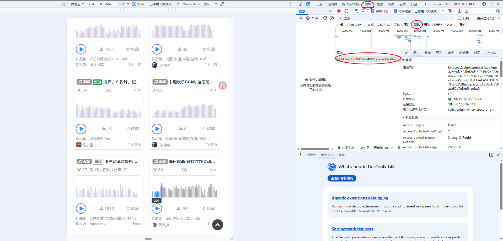
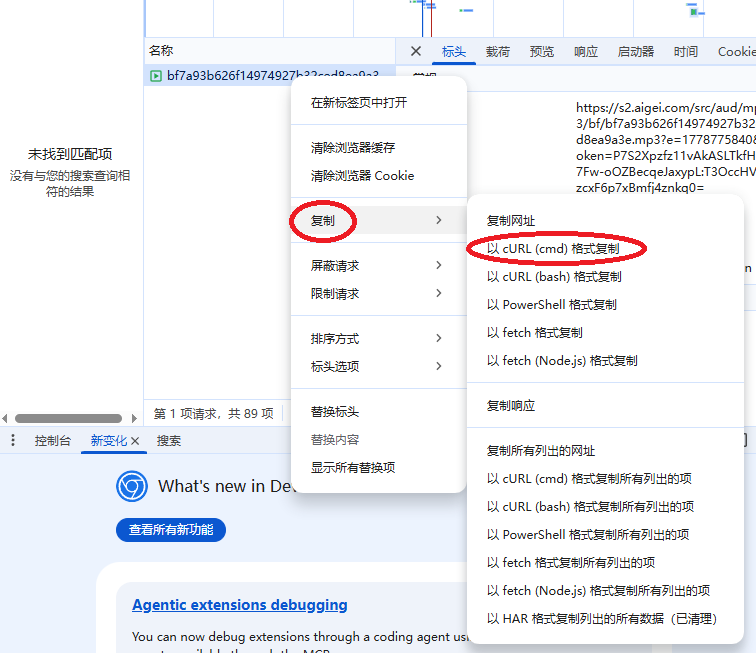
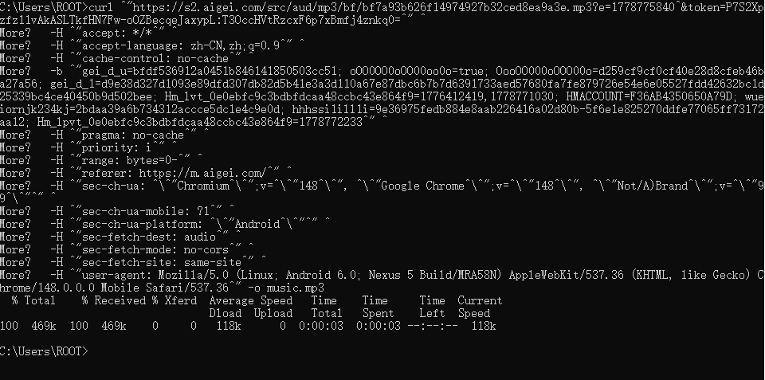

# 如何下载爱给网的音频

爱给网以前可以直接在控制台的 Network 里找到音频文件，然后复制链接下载，现在直接复制链接经常不好用了，比较稳的办法是找到真正的 mp3 请求之后，复制 curl，再用终端把文件拉下来。

## 1. 找到 mp3 请求

先打开爱给网对应的音频页面，按 F12 打开开发者工具，切到 Network 面板，然后刷新一下页面。

这里可以在过滤框里搜 `mp3`，也可以点上面的 Media 分类。页面播放音频的时候，Network 里一般就会出现真正的音频请求。



点开这个请求，看一下右侧的 Headers，确认它的 Request URL 结尾是 `.mp3`，或者 Response Headers 里的 Content-Type 是音频类型。

## 2. 复制 curl

在这个 mp3 请求上右键，选择 Copy，再选择 Copy as cURL。

如果是在 Windows 上，建议复制 `Copy as cURL (cmd)`，然后粘到 cmd 里执行；如果你用 Git Bash，就复制 `Copy as cURL (bash)`。



复制出来的命令通常会很长，里面会带上 cookie、referer、user-agent 这些东西。现在爱给网不能直接复制链接下载，就是因为服务端会检查这些请求头，直接裸链接访问就会失败。

## 下载到本地

把复制出来的 curl 粘到终端里，在最后加上输出文件名。

如果是 cmd 版本，一般在最后加：

```cmd
-o music.mp3
```

例如：

```cmd
curl "这里是很长的 mp3 地址" ^
  -H "referer: https://www.aigei.com/" ^
  -H "user-agent: Mozilla/5.0 ..." ^
  -o music.mp3
```

如果是 bash 版本，一般是：

```bash
curl '这里是很长的 mp3 地址' \
  -H 'referer: https://www.aigei.com/' \
  -H 'user-agent: Mozilla/5.0 ...' \
  -o music.mp3
```

这里不用照抄我上面的例子，实际以浏览器复制出来的那一整段为准，只要在末尾加上 `-o 文件名.mp3` 就行。



下载完成后，当前目录下就会多出一个 mp3 文件，双击能正常播放就说明成功了。

## 几个容易踩坑的地方

1. 如果终端提示 403，大概率是复制错请求了，或者复制出来的 cookie 过期了，重新刷新页面再复制一次。
2. 如果下下来的是 html，不是 mp3，说明这个请求不是真正的音频文件，回到 Network 里继续找。
3. bash 版本的 curl 直接粘到 cmd 里经常会失败，因为换行符和引号不一样，复制的时候要选对版本。
4. 文件名最好自己指定，比如 `-o bgm.mp3`，不然 curl 可能会保存成一串很奇怪的名字。
